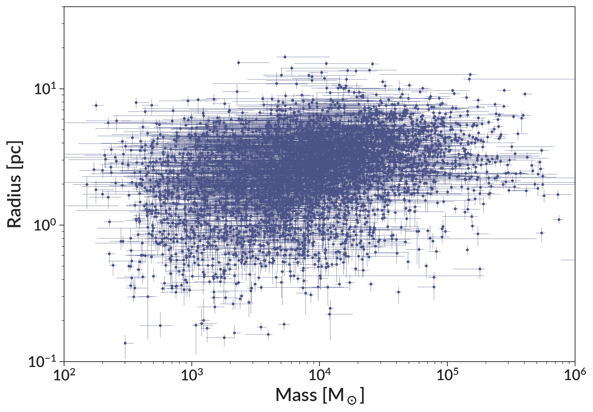

# Cluster Catalog

This page summarizes the cluster catalogs generated in Brown & Gnedin 2021. The catalog includes the radii, all EFF fit parameters, densities, errors on all these parameters, and a few key LEGUS properties such as mass and age. All data needed to replicate plots 10-17 is included in this catalog. Any references below to equations or figures are from our paper.

The catalog can be downloaded with `wget`: 
```
wget https://raw.githubusercontent.com/gillenbrown/LEGUS-sizes/master/cluster_sizes_brown_gnedin_21.txt
```
It can also be directly accessed at that URL. 

In what follows we demonstrate how to load and use the data, then detail what each column in the data is.

## Reading the Data

The catalog is written with Astropy in the `.ecsv` format, which can be read by any `.csv` reader, but allows for preservation of data types when read by Astropy. Here is an example of how to reconstruct the data shown in Figure 11.

```python
from astropy import table
import matplotlib.pyplot as plt
import numpy as np

catalog = table.Table.read("cluster_sizes_brown_gnedin_21.txt", format="ascii.ecsv")

# parse the LEGUS mass errors
catalog["mass_msun_e-"] = catalog["mass_msun"] - catalog["mass_msun_min"]
catalog["mass_msun_e+"] = catalog["mass_msun_max"] - catalog["mass_msun"]

# get the clusters with reliable radii and masses.
mask = catalog["reliable_radius"] & catalog["reliable_mass"]
subset = catalog[mask]

# plot the data
fig, ax = plt.subplots()
ax.errorbar(
    x=subset["mass_msun"],
    y=subset["r_eff_pc"],
    fmt="o",
    markersize=2,
    lw=0.3,
    xerr=[subset["mass_msun_e-"], subset["mass_msun_e+"]],
    yerr=[subset["r_eff_pc_e-"], subset["r_eff_pc_e+"]],
)

# plot formatting
ax.set_xscale("log")
ax.set_yscale("log")
ax.set_xlim(1e2, 1e6)
ax.set_ylim(0.1, 40)
ax.set_xlabel("Mass [$M_\odot$]")
ax.set_ylabel("Radius [pc]")
```


## Catalog Columns

Here we detail the meaning of all columns in the data table.

### Basic Cluster Properties

**`field`**

The identifier for the LEGUS field. Note that some galaxies are split over multiple fields (NGC 1313, NGC 4395, NGC 628, and NGC 7793), and that one field contains multiple galaxies (NGC 5194 and NGC 5195).


**`ID`**

The cluster ID assigned by LEGUS. This was done on a field-by-field basis.


**`galaxy`**

The galaxy the cluster belongs to. NGC 5194 and NGC 5195 are separated manually (see Figure 1). 


**`galaxy_distance_mpc`, `galaxy_distance_mpc_err`**

Distance to the galaxy and its error, in Mpc. We use the TRGB distances to all LEGUS galaxies provided by [Sabbi et al. 2018](https://ui.adsabs.harvard.edu/abs/2018ApJS..235...23S/abstract), except for NGC 1566. See the end of Section 2.4 for more on distances used.


**`galaxy_stellar_mass`, `galaxy_sfr`, `galaxy_ssfr`**

Stellar masses, star formation rates, and specific star formation rates of the host galaxy, from [Calzetti et al. 2015](https://ui.adsabs.harvard.edu/abs/2015AJ....149...51C/abstract). See the caption of Table 1 for more details. Stellar masses are in M<sub>⊙</sub>, star formation rates are in M<sub>⊙</sub>yr<sup>-1</sup>, and specific star formation rates are in yr<sup>-1</sup>.


### LEGUS Cluster Properties

These properties come from the LEGUS catalogs. If using quantities from those papers, please cite them appropriately:
 [Calzetti et al. 2015](https://ui.adsabs.harvard.edu/abs/2015AJ....149...51C/abstract), [Adamo et al. 2017](https://ui.adsabs.harvard.edu/abs/2017ApJ...841..131A/abstract), [Cook et al. 2019](https://ui.adsabs.harvard.edu/abs/2019MNRAS.484.4897C/abstract).

**`RA`, `Dec`**

Right ascension and declination from the LEGUS catalog.


**`x_pix_single`, `y_pix_single`**

X/Y pixel position of the cluster from the LEGUS catalog.


**`morphology_class`**

Classification of the morphology of the clusters by LEGUS. Class 1 objects are compact and centrally concentrated with a homogeneous color. Class 2 clusters have slightly elongated density profiles and a less symmetric light distribution. We do not include Class 3 (compact associations) or Class 4 (stars or artifacts) objects in this catalog.


**`morphology_class_source`**

The source of the classification of the morphology in the `morphology` attribute. When available, we use the mode of the classifications from multiple LEGUS team members, called `human_mode` in this column. Additionally, machine learning classifications (`ml`) are available for several galaxies. For NGC 5194 and NGC 5195, we use the human classifications for clusters where those are available, and supplement with machine learning classifications for clusters not inspected by humans. In NGC 1566, we use the hybrid classification system (`hybrid`) created by the LEGUS team, where some clusters are inspected by humans only, some by machine learning only, and some with a machine learning classification verified by humans.


**`age_yr`, `age_yr_min`, `age_yr_max`**

Cluster age in years and its minimum and maximum allowed value from LEGUS. This uses the deterministic SED fitting method presented in [Adamo et al. 2017](https://ui.adsabs.harvard.edu/abs/2017ApJ...841..131A/abstract).


**`mass_msun`, `mass_msun_min`, `mass_msun_max`**

Cluster mass in M<sub>⊙</sub> and its minimum and maximum allowed value from LEGUS using the same SED fitting as `age_yr`. 


### Fit Parameters

The catalog includes all the fit parameters and their errors. The EFF profile takes the basic form:


We generalize this (Equations 2-4) to include ellipticity by including an axis ratio and position angle. 

The errors on these parameters are marginalized over all other parameters. The lower error is simply the best fit value of that parameter minus the 16th percentile of the parameter's distribution for all bootstrap iterations. Similarly, the upper error is the 84th percentile of the bootstrap distribution minus the best fit value.

**`x_fitted`, `x_fitted_e-`, `x_fitted_e+`, `y_fitted`, `y_fitted_e-`, `y_fitted_e+`**

The x/y pixel position. 


**`mu_0`, `mu_0_e-`, `mu_0_e+`**

The central pixel value μ<sub>0</sub>, in units of electrons. Note that this is the peak pixel value of the raw profile before convolution with the PSF and rebinning (see Equation 8), so it may not be directly useful.


**`scale_radius_pixels`, `scale_radius_pixels_e-`, `scale_radius_pixels_e+`**

Scale radius a, in units of pixels.


**`axis_ratio`, `axis_ratio_e-`, `axis_ratio_e+`**

Axis ratio q, defined as the ratio of the minor to major axis, such that 0 < q ≤ 1.


**`position_angle`, `position_angle_e-`, `position_angle_e+`**

Position angle θ, in radians. Note that since the profile is assumed to be axisymmetric, 0 ≤ θ < π.


**`power_law_slope`, `power_law_slope_e-`, `power_law_slope_e+`**

Power law slope η.


**`local_background`, `local_background_e-`, `local_background_e+`**

Value of the local background, in units of electrons.


**`num_bootstrap_iterations`**

Number of bootstrap iterations done to calculate errors on fit parameters.


### Fit Quality Indicators

**`radius_fit_failure`**

Whether a given cluster is identified as having a failed radius fit. We define this as as a scale radius a < 0.1 pixels, a > 15 pixels, or an axis ratio q < 0.3. We also exclude any clusters where the fitted center is more than 2 pixels away from the central pixel identified by LEGUS.


**`fit_quality_metric`**

Our metric to evaluate the fit quality, defined in Equation 16. It uses the cumulative light profile to estimate the half-light radius of the cluster non-parametrically, then compares the enclosed light of the model and data within this radius. This value is the fractional error of the enclosed light of the model.


**`reliable_radius`**

Whether or not this cluster radius is deemed to be reliable. To be reliable, a cluster must not have a failed fit (see above), and must not be in the worst 10th percentile of `fit_quality_metric` among clusters with successful fits. See Section 2.6 for more on this. Our analysis in the paper only uses clusters deemed to be reliable.


**`reliable_mass`**

Whether or not we consider this cluster to have a reliable measurement of the mass. This relies on a consideration of the Q statistic (see Section 3.3 for more on this). For any analysis using masses or ages, we only consider clusters with reliable masses.


### Effective Radius

Here we include the effective radius R<sub>eff</sub> (the projected half light radius) and its errors. See Section 2.5 for more on how this is calculated. The errors are marginalized over all other fit parameters. We calculate the effective radius of each bootstrap iteration, then use the percentiles to determine the upper and lower errors. The lower error is the best fit R<sub>eff</sub> minus the 16th percentile R<sub>eff</sub>, while the upper error is the 84th percentile R<sub>eff</sub> minus the best fit R<sub>eff</sub>. The errors for R<sub>eff</sub> in pixels and arcseconds only include the uncertainty in radius, while the errors for R<sub>eff</sub> in parsecs also include the uncertainty in galaxy distance.

**`r_eff_pixels`, `r_eff_pixels_e-`, `r_eff_pixels_e+`**

The cluster effective radius in units of pixels. 


**`r_eff_arcsec`, `r_eff_arcsec_e-`, `r_eff_arcsec_e+`**

The cluster effective radius in units of arcseconds. We provide this to make it easier for future users (i.e. you) to modify the galaxy distance estimates assumed in our paper if so desired.


**`r_eff_pc`, `r_eff_pc_e-`, `r_eff_pc_e+`**

The cluster effective radius in units of parsecs. The galaxy distances in this table were used to convert from arcseconds to parsecs. The uncertainty here includes the uncertainty in galaxy distance. 


### Derived Properties

We also calculate some quantities that use both the mass and radius. For the errors on these quantities, we symmetrize both the mass and radius errors, then propagate them analytically. These uncertainties include the uncertainty in galaxy distance. Note that the errors are on the log space quantity, so the error range given here should be interpreted as log<sub>10</sub>(`quantity`) ± `quantity_log_err`. 

**`crossing_time_yr`, `crossing_time_log_err`**

The cluster crossing time, as defined by [Gieles & Portegies Zwart 2011](https://ui.adsabs.harvard.edu/abs/2011MNRAS.410L...6G/abstract) (our equation 21). 


**`density`, `density_log_err`**

The cluster average mass density within the half light radius ρ<sub>h</sub> as defined by Equation 22, in units of M<sub>⊙</sub>pc<sup>-3</sup>.


**`surface_density`, `surface_density_log_err`**

The cluster average surface mass density within the half light radius Σ<sub>h</sub> as defined by Equation 22, in units of M<sub>⊙</sub>pc<sup>-2</sup>.


