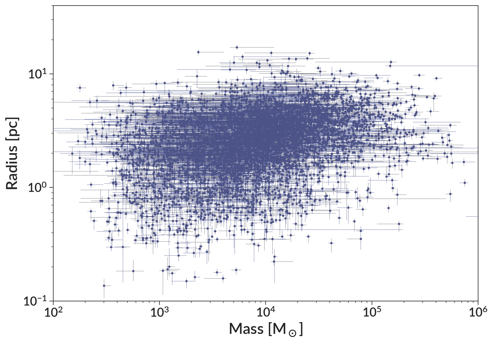

# Cluster Catalog

This page summarizes the cluster catalogs generated in Brown & Gnedin 2021. The catalog includes the radii, all EFF fit parameters, densities, errors on all these parameters, and a few key LEGUS properties such as mass and age. All data needed to replicate plots 10-17 is included in this catalog. Any references below to equations or figures are from our paper.

The catalog can easily be downloaded with `wget`: 
```
wget https://raw.githubusercontent.com/gillenbrown/LEGUS-sizes/master/cluster_sizes_brown_gnedin_21.txt
```
It can also be directly accessed at that URL. 

In what follows we demonstrate how to load and use the data, then detail what each column in the data is.

## Reading the Data

The catalog is written with Astropy in the `.ecsv` format, which can be read by any `.csv` reader, but allows for preservation of data types when read by Astropy. Here is an example of how to reconstruct the data shown in Figure 11.

```python
__insert_code_here__
```


## Catalog Columns

Here we detail the meaning of all columns in the data table.

### Basic Cluster Properties

__template__field__template__

__template__id__template__

__template__galaxy__template__

__template__distance__template__

__template__galaxy_props__template__

### LEGUS Cluster Properties

These properties come from the LEGUS catalogs. If using quantities from those papers, please cite them appropriately:
 [Calzetti et al. 2015](https://ui.adsabs.harvard.edu/abs/2015AJ....149...51C/abstract), [Adamo et al. 2017](https://ui.adsabs.harvard.edu/abs/2017ApJ...841..131A/abstract), [Cook et al. 2019](https://ui.adsabs.harvard.edu/abs/2019MNRAS.484.4897C/abstract).

__template__ra_dec__template__

__template__xy_legus__template__

__template__morphology__template__

__template__morphology_source__template__

__template__age__template__

__template__mass__template__

### Fit Parameters

The catalog includes all the fit parameters and their errors. The EFF profile takes the basic form:


We generalize this (Equations 2-4) to include ellipticity by including an axis ratio and position angle. 

The errors on these parameters are marginalized over all other parameters. The lower error is simply the best fit value of that parameter minus the 16th percentile of the parameter's distribution for all bootstrap iterations. Similarly, the upper error is the 84th percentile of the bootstrap distribution minus the best fit value.

__template__xy__template__

__template__mu__template__

__template__a__template__

__template__q__template__

__template__theta__template__

__template__eta__template__

__template__bg__template__

__template__bootstrap__template__

### Fit Quality Indicators

__template__fit_failure__template__

__template__prof_diff__template__

__template__reliable_radius__template__

__template__reliable_mass__template__

### Effective Radius

Here we include the effective radius and its errors. The errors are marginalized over all other fit parameters. We calculate the effective radius of each bootstrap iteration, then use the percentiles to determine the upper and lower errors. The lower error is the best fit value minus the 16th percentile value, while the upper error is the 84th percentile value minus the best fit value. The errors for R<sub>eff</sub> in pixels and arcseconds only include the uncertainty in radius, while the errors for R<sub>eff</sub> also include the uncertainty in galaxy distance.

__template__r_eff_pix__template__

__template__r_eff_arcsec__template__

__template__r_eff_pc__template__

### Derived Properties

We also calculate some quantities that use both the mass and radius. For the errors on these quantities, we symmetrize both the mass and radius errors, then propagate them analytically. Note that the errors are on the log space quantity, so the error range given here should be interpreted as log<sub>10</sub>(`quantity`) ± `quantity_log_err`. 

__template__crossing_time__template__

__template__density__template__

__template__surface_density__template__

